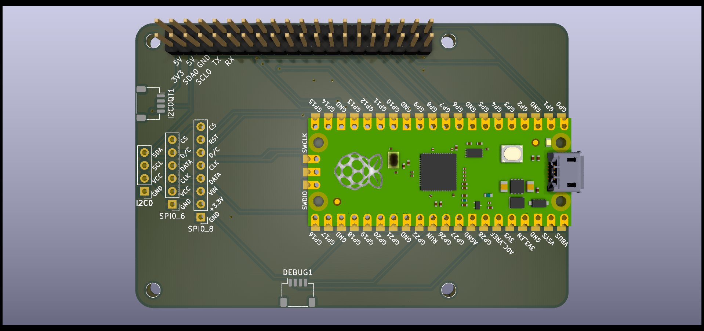

# The Chocolate Croissant

Yeah the name is stupid, I know.

A breakout board for when you want to fit a Raspberry Pi [34] B hat onto a Raspberry Pi Pico or fit a Raspberry Pi Pico in
something that expects a full Raspberry Pi [34] B.

The Raspberry Pi Pico W fits too of course, but the debug pins aren't connected on the PCB, not yet at least.

